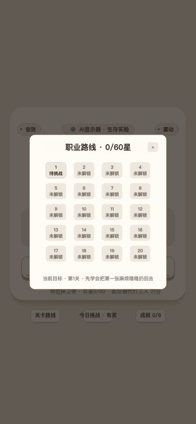
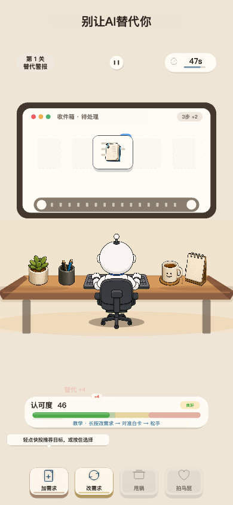
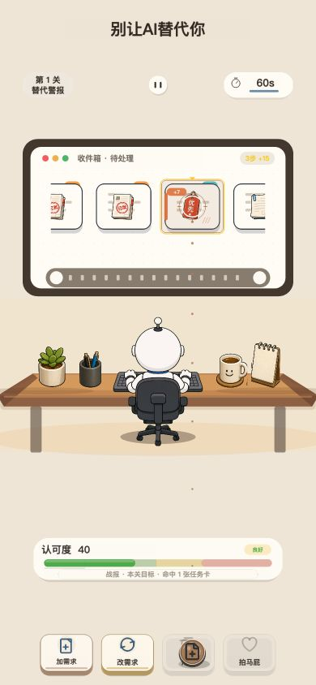
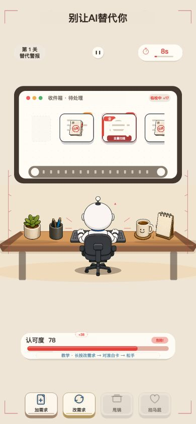
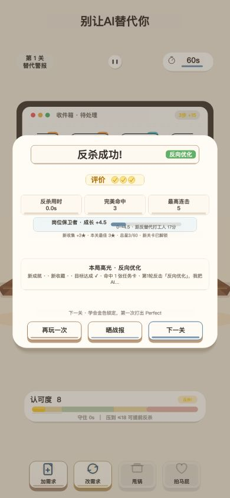
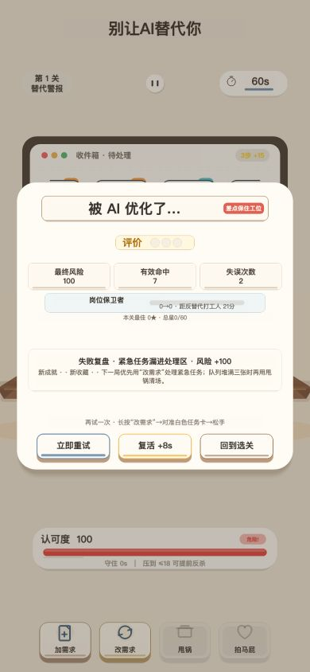

# 《别让 AI 替代你》全流程体验审计与下一阶段规划

审计日期：2026-07-23
审计范围：首页、选关页、游戏页、投掷/危机状态、胜负结算页、关卡数值、代码与工程质量。
验证环境：Cocos Creator Web Mobile 构建，390×844 视口；同时运行 TypeScript 检查、完整单测和 20 关批量模拟。

## 一句话结论

项目已经从“原型”进入了“可完整游玩的垂直切片”：美术主题统一、核心玩法成立、20 关和外围功能基本齐全，工程测试基础也明显好于同阶段项目。当前最大短板不是功能数量，而是首局理解成本、决策信息可读性、关卡曲线和流程层级还没有形成同样成熟的一体化体验。

下一轮应优先完成 **P0：首局闭环重构**，把首页教学、第一局操作反馈、卡片信息、危机提示和结算教学串成一个 60 秒内能理解、能爽到、失败也知道为什么的闭环。

## 流程审计

### 1. 首页 — 健康度：良好，但教学文案已经落后于操作

做得好的地方：

- 标题、办公桌隐喻和暖纸张美术建立了清晰的产品记忆点。
- “继续第 1 关”是明确的唯一主按钮，进入成本低。
- 音效、震动、关卡路线、挑战和成就入口都已经具备。

主要问题：

- 首页仍写“长按蓄力”，与当前“轻点快速使用、拖拽投掷”的实际操作不一致。这会直接制造错误心智模型。
- 主卡上下留白过多，核心信息密度偏低；排行说明和底部入口文字偏小。
- “AI 显示器·生存实验”更像内部世界观标签，不能帮助新玩家理解目标。
- 三步图示讲了手势，却没有讲最重要的决策：为什么要打某张卡、命中后会发生什么。

建议：把首屏改成“一个目标 + 两种动作 + 一个结果”：先告诉玩家保住认可度，再用动态演示区分轻点与拖甩，最后直接展示命中卡片后加/减分的反馈。

### 2. 选关页 — 健康度：可用，但缺少进程感和关卡期待

做得好的地方：

- 20 关和总星数一屏可见，结构简单，不会迷路。
- 已解锁、未解锁状态存在，返回和选择路径明确。

主要问题：

- 20 个外观接近的方格让页面像调试面板；玩家看不到章节、主题、机制、Boss 或奖励。
- 除关卡号外，缺少“这一关有什么不同”的信息，选关没有期待感。
- 当前关、推荐关、Boss 关的视觉权重不足；大量“未解锁”产生重复噪声。
- 星星目前只是门槛数字，没有连接到装扮、称号或玩法解锁。

建议：重排成 4 章 × 5 关的职业路线，每章拥有一个视觉主题、一个新机制和一个节点 Boss；当前关突出显示机制预告与奖励，锁定关弱化为路线节点。

### 3. 游戏页 — 健康度：核心成立，但信息和操作尚未完全对齐

做得好的地方：

- 显示器传送带、打工人和桌面道具形成了完整的场景隐喻。
- 计时、认可度、暂停和道具都能在一屏内看到。
- 危机阶段的红色边框、计时变色和角色状态能被快速感知。

主要问题：

- 卡片上的类别、数值和风险信息偏小，但它们恰好是玩家每秒最需要判断的信息。
- 视线要在顶部计时、显示器卡片、中部角色、底部认可度和最底部道具之间长距离跳转。
- 场景中部存在较大空档，而决策区和按钮区仍显拥挤；布局空间没有服务核心决策。
- 当前按钮名称更像系统功能，尚未形成强烈的“拿起道具—瞄准—甩出—命中反馈”的动作链。
- 游戏标题长期占据顶部黄金区域，但战斗中没有实际信息价值。

建议：把“卡片风险、当前目标、认可度变化预告”聚合到显示器附近；放大卡片关键字段；将道具按状态显示成可拿起的实体；投出后让命中卡片出现明确的形变、盖章、颜色和数值变化。

### 4. 投掷与瞄准 — 健康度：方向已对，但反馈语言仍不够物理直觉

主要问题：

- 路径点较淡，起点、飞行方向和落点没有形成一条强烈的视觉因果链。
- 目标虽有高亮，但玩家仍需要推断“当前会打中谁、命中后改变什么”。
- 路径穿过角色和桌面，视觉上容易被场景细节吃掉。
- 轻点快速使用与拖甩投掷是两种语义，首页和局内没有把它们明确区分。

建议：保留单步操作，不引入“先选再投”的两步模式。轻点应表现为就近、短弧、自动锁定；拖甩应表现为手中道具跟随、速度决定弧高、释放点决定方向。落点高亮直接显示目标卡名称及预计加减分，取消时有明确回弹。

### 5. 危机状态 — 健康度：有效，但红色提示略显竞争

做得好的地方：红色边框、危险标签、计时和角色反应共同建立了压力。

主要问题：边框、计时、认可度、标签和卡片同时争夺注意力；危机很明显，但“现在最该做什么”不够明确。

建议：确立一个主警报源，例如将认可度作为主警报，其余红色提示降级；危机触发时短暂聚焦最危险卡并给出一次可关闭的行动提示。

### 6. 胜利结算 — 健康度：功能完整，但奖励层级偏平

做得好的地方：结果、星级、三项数据和下一步操作都齐全，胜利文案符合产品语气。

主要问题：星级、数据、职业进度、本周高光和三个按钮分成多个等权横条，胜利高潮被密集小字摊薄；“下一关”没有获得足够主按钮权重。

建议：结算先给一个大结果和最有价值的高光，再展示一条“为什么赢”的教学结论；下一关作为唯一主动作，重玩和分享降为次级操作。

### 7. 失败结算 — 健康度：可恢复，但教学价值不足

做得好的地方：立即重试、复活和回选关都存在，没有把玩家困在死路。

主要问题：失败原因偏总结性，不能直接映射到下一局动作；复活是否需要广告或奖励机制没有提前说明；三个按钮权重接近；底层游戏 HUD 仍透出并与弹窗竞争。

建议：只突出一个本局首要失误，例如“连续放过 3 张高风险卡”；给一个可执行建议并在重试时标记相同风险。复活按钮明确成本，背景进一步降噪。

## 游戏逻辑与数值审计

20 关批量模拟暴露出的关键问题：

- 防守型机器人总体生存率约 94%，大部分普通关偏宽松，但第 13、18 关胜率分别骤降到 38% 和 41%。
- 第 12→13→14 关为 74%→38%→100%，第 17→18→19 关为 66%→41%→100%，难度锯齿过大。
- 第 10 关首个 Boss 胜率 96%，反而明显比第 9 关的 75% 简单，Boss 高潮不足。
- 第 20 关防守胜率 70%，却比第 18 关容易；进攻型机器人的狩猎胜率仅 1%，让另一条胜利路径在最终关几乎消失。

建议保留“高压关—喘息关”的节奏，但喘息关不应稳定到 100%，Boss 也不应只是参数更大。下一轮先调 L1–L5 的学习曲线，再调整 L9–L10、L12–L14、L17–L20 三组关键区间。

## 工程与生产质量审计

优势：

- `core` 纯 TypeScript 逻辑、确定性随机数、QA 场景和批量模拟构成了很好的可测试基础。
- 当前 TypeScript 检查通过，21 个测试文件、175 项测试全部通过。
- 20 关配置、成长、挑战、成就、分享、复活、埋点和运行时监控已经具备，功能完成度高。

风险与建议：

- `GameRunner.ts` 约 5,049 行，同时承担流程、首页、选关、输入、布局、战斗、结算和资源加载，已成为迭代风险中心。拆成 FlowController、HomeView、CareerRouteView、GameplayHUD、GestureController、ResultPresenter 与 EnvironmentRenderer。
- `FxLayer.ts` 约 1,290 行；高频 Node/Graphics 动态创建可能带来低端设备 GC 抖动，应先实机采样，再对高频特效做对象池与静态绘制缓存。
- `PropDockView.ts` 看起来已不再被使用，README 和路线文档仍描述旧“长按滑轨”交互，测试数量也停留在 132；应清理死代码并同步文档。
- JSON 配置通过类型断言接入，建议增加启动期 schema 校验，避免内容改动导致运行时才报错。
- 缺少自动 lint；CI 应固定执行 typecheck、test、web build、微信小游戏 build 和关键截图回归。
- Canvas UI 缺少系统级语义焦点；至少补齐更大触控区、文字对比度、减少动效选项和低端机特效档位。

## 下一阶段路线图

### P0：首局闭环重构（下一轮直接做）

1. 首页教学改成当前真实交互：轻点快速使用、拖甩精准投掷。
2. L1 做成渐进式教学：先识别风险卡，再轻点，最后拖甩；每一步只引入一个概念。
3. 放大卡片关键字段，明确目标高亮、预计加减分和命中后的视觉变化。
4. 收紧游戏 HUD，让认可度与当前决策靠近，减少上下视线跳转。
5. 简化胜负结算：一个结论、一个学习点、一个主按钮。
6. 为“首次理解耗时、无效释放、目标切换、误投、道具使用、关卡失败原因”补埋点。

验收标准：新玩家 10 秒内知道目标；首次操作无需二次点击；投出前能预测目标，投出后能解释结果；L1 首次完成率 75%–90%，且失败玩家知道下一局要改什么。

### P1：关卡结构与爽感（P0 验证后）

- 将 20 关组织为 4 章，每章引入一种新机制，并用 Boss 验收机制掌握度。
- 重调关键难度断层和最终关双胜利路径。
- 为四种道具建立不同的拿起、飞行、命中、卡片反应和音效身份。
- 增加连击、精准甩投、危机反杀等短周期爽点，但避免覆盖核心信息。

### P2：成长与留存

- 让星星明确解锁装扮、称号、桌面物件或新道具表现，而不是只做门槛。
- 选关页展示章节目标、机制预告、奖励和最佳成绩。
- 今日挑战、成就和分享从首页小入口升级为可感知的奖励循环。
- 结算页给出下一关钩子与成长预览。

### P3：工程治理与发布质量

- 拆分 `GameRunner`，清理旧道具滑轨代码和过期文档。
- 建立配置校验、lint、CI、微信构建冒烟、关键流程截图回归。
- 在真机记录帧耗时、内存、首次加载和特效峰值，按数据决定对象池与资源预热范围。
- 建立关卡漏斗和版本对比看板，用真实玩家数据校准模拟机器人。

## 推荐执行顺序

不要先做更多外围功能，也不要先全面翻新美术。先集中完成首页→L1→结算这一条首局闭环；验证操作理解与首关完成率后，再把同一套信息层级、手感和反馈扩展到 20 关。这样能同时提升顺畅、爽感、逻辑合理性、视觉反馈和后续内容扩展效率。

## 审计边界

本次验证覆盖 Web Mobile 构建与自动化模拟，没有替代微信真机上的触摸采样、震动、音频延迟、低端机性能和广告/分享 SDK 联调。进入发布优化阶段前，仍需至少一轮微信真机设备矩阵测试。
